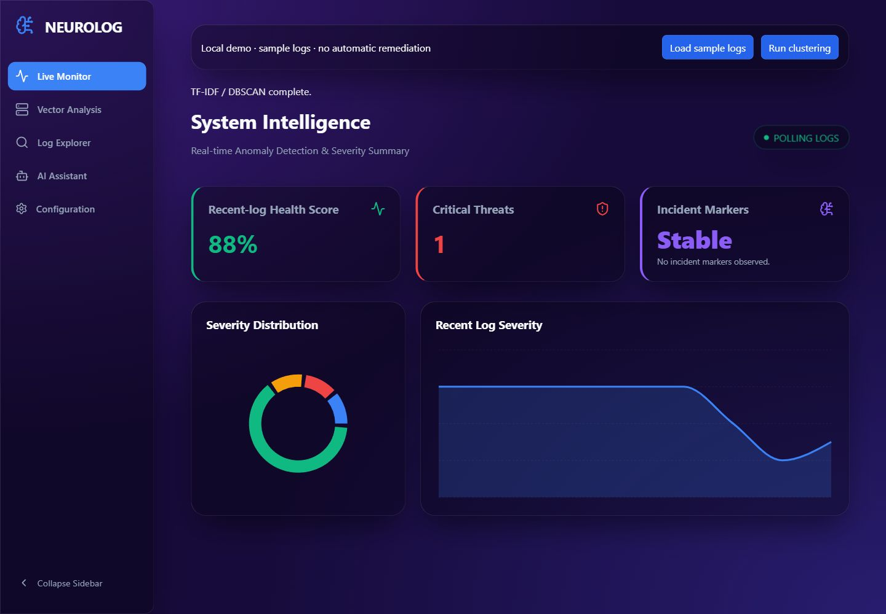

# NeuroLog AI

A local log observability application with React, Flask, SQLite, TF-IDF/DBSCAN clustering, and optional Firebase authentication and Groq advisory responses.

## Preview



## Run on Windows

Requires Python 3.12 and Node.js 22.12+.

```powershell
python -m venv .venv
.\.venv\Scripts\python.exe -m pip install -r requirements-lock.txt
cd logintel_ui
npm ci
cd ..
.\.venv\Scripts\python.exe LogIntel_engine\api.py
```

In another terminal:

```powershell
cd logintel_ui
npm run dev
```

Open http://127.0.0.1:5173. Click **Load sample logs**, then **Run clustering**. Demo mode needs no external accounts and persists data in `data/neurolog.db`. Keep the demo local; real accounts require both demo flags disabled and your own Firebase configuration.

A convenience launcher is also available: `powershell -ExecutionPolicy Bypass -File .\start.ps1`.

## Learn and configure

- [User guide](docs/USER_GUIDE.md): setup, workflow, ingestion examples, architecture, Firebase/Groq configuration, and troubleshooting.
- [PDF guide](output/pdf/NeuroLog_User_Guide.pdf): printable version of the guide.
- [Repair and validation notes](docs/REPAIR_NOTES.md).

Copy root `.env.example` to `.env` for backend configuration, and `logintel_ui/.env.example` to `.env.local` inside `logintel_ui` for frontend configuration. Secrets and runtime databases are ignored by Git.

## What is implemented

- API-key ingestion with validation and UTC timestamps.
- Workspace ownership verified through Firebase tokens in authenticated mode.
- Durable SQLite storage, retention settings, and scoped log purging.
- Live Monitor, Log Explorer search/severity filters, and Vector Analysis.
- On-demand TF-IDF and DBSCAN clustering of the latest 100 messages.
- Local demo advisor, or live Groq responses when configured.
- Appearance settings and optional desktop alerts for newly observed critical logs.
- Optional Node compatibility gateway and log simulator.

The health score is a heuristic over recent critical logs. Text outliers are review candidates, not proof of faults. Incident cards reflect supplied log markers. This code does not include XGBoost, HDBSCAN, a validated 94% accuracy result, or automatic remediation. Slack/email integrations and alternate assistant styles are disabled rather than presented as working controls.

## Verification

```powershell
.\.venv\Scripts\python.exe -m pytest -q
cd logintel_ui
npm run lint
npm run build
npm audit
cd ..\server
npm run check
npm audit
```

GitHub Actions repeats backend tests, frontend lint/build, gateway syntax checks, and npm audits.

## Attribution

Based on [Sai-Nitin123/Neurolog-AI](https://github.com/Sai-Nitin123/Neurolog-AI). Original contributors: Sai Nitin, Dhruv Patel, and Manoj Kolapalli. The original [MIT license](LICENSE) is retained. The legacy MongoDB/file-courier examples are separate from the supported SQLite dashboard pipeline.
